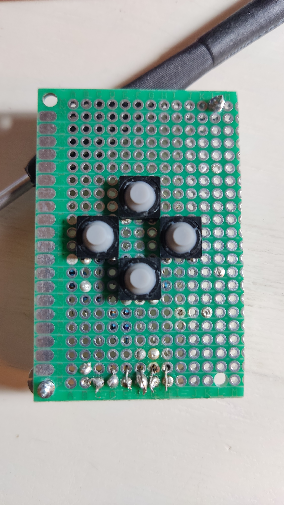
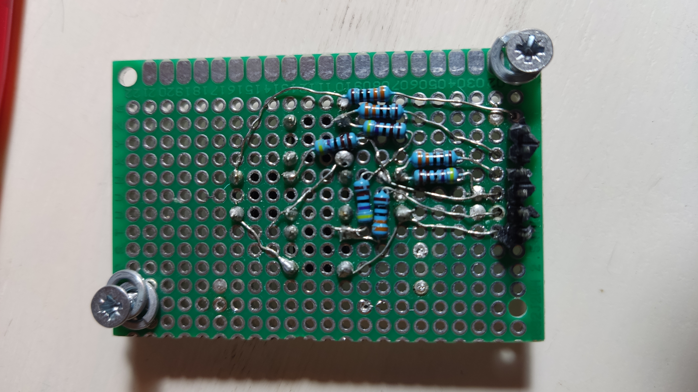
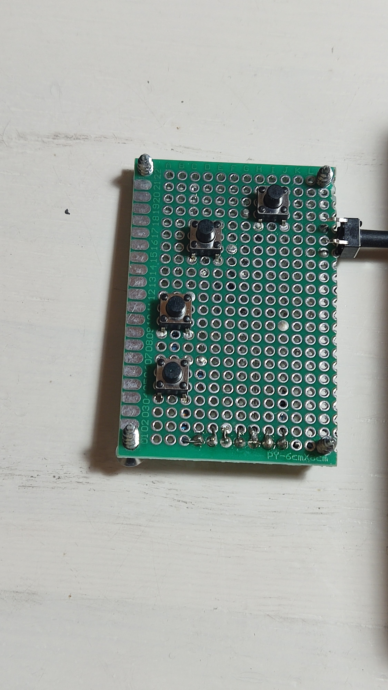
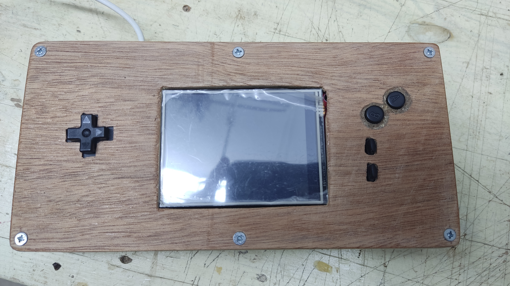
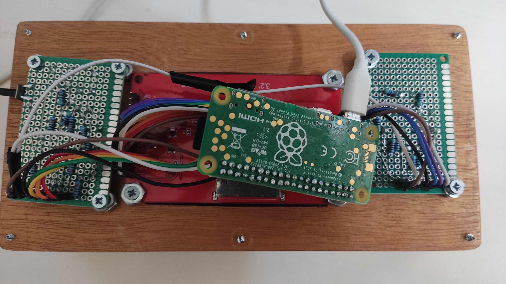

# RealMagenBoy!

This document contains notes and instructions on how to make a real physical Gameboy using this emulator, a RaspberryPi, a SPI screen and a couple of buttons!

## Compatability 
The software have been tested on the following models:
* Raspberry Pi 4 model B 
* Raspberry Pi zero2 W 

Theoritacly the following models should also work:
* Raspberry Pi 3 model B 
* Raspberry Pi 3 model B+
* Raspberry Pi 400

Currently MagenBoy isn't fast enough to run on older RPi models

## Required parts
* Fast enough Raspberry Pi ([See](#Compatability))
* An ili9341 spi display - [The one I use](http://www.lcdwiki.com/3.2inch_SPI_Module_ILI9341_SKU:MSP3218), can be found on aliexpress or ebay for about 10$
* Buttons - Tactile switch buttons or soft tactile switch buttons (for the dpad) 
* Resistors - Im not an Electrical engineer but it is recommended to not connect the buttons directly to the GPIO but instead add a resistor to protect the Pi ([resource](https://forums.raspberrypi.com/viewtopic.php?t=216304))
* Jumper cables - to connect all the parts together, (you can solder with a regular wire, but as a software guy I dont like to permemantly connect stuff)
### Optional
Not necessary for a working real life gameboy but can make it nicer
* Prototype PCB - The green flat ones with holes, to connect to buttons to
* Solderer - to connect the buttons and the resistors to the prototype PCB
* A case - if you have a case (or a way to make one) it will make it way more awsome

## Assembling

### Before starting
Rpi sometimes uses BCM numbers and not actual physical pin number, I have tried to be clear when I reffer to BCM pin and to physical pin - for more about [What is BCM](https://iot4beginners.com/difference-between-bcm-and-board-pin-numbering-in-raspberry-pi/)

### Connect the SPI display

Right now Im ignoring the touch control and connecting like this table to the RPi (this note is about the display mentioned in the [required parts section](#required-parts), and not fit for any ili9341 display but can be adjusted to match)

```
lcd | RPi physical pin |   comment
1   |   1              |   power - connected to the 3.3 pin (any 3.3v power pin)
2   |   9              |   ground (any ground pin)
3   |   24             |   spi chip select - connected to the spi0 cs 
4   |   8              |   reset - pin GPIO BCM 14 (any GPIO pin, after changing need to change the software too)
5   |   10             |   dc - pin GPIO BCM 15 (any GPIO pin, after changing need to change the software too)
6   |   19             |   mosi - spi bus write data signal - connected to the spi0 mosi
7   |   23             |   sck - spi bus clock signal - connected to the spi0 sck
8   |   22             |   led - - pin GPIO BCM 25 (any GPIO pin, after changing need to change the software too)
9   |   21             |   miso - spi bus read data signal - connected to the spi0 miso
```

> **Warning** 
> The RPi peripherals speed is coupled to main CPU speed to in order to get consistent performance it's necessaty setting it a fix value (on the RPi zero2 I found this config best suited)

Edit `/boot/config.txt` with the following configurations
```
core_freq=300
core_freq_min=300
```
Make sure that dtparam=spi is turned of, should be commented out or be like this `dtparam=spi=off` (MagenBoy interface the SPI peripherlas directly without the linux driver for better transfer times)

### Buttons

I created (using the prototypes PCB's and a solderer) 2 PCB's, one for the Dpad and one for A, B, Start, Select buttons, each contains 4 buttons and exposes 6 pins to be connected with a jumper cable, this is just a recommendation and an example of how this should be done.

#### Dpad connection

> I used soft tactile buttons here for a better authentic feel

```
Pin | RPi physical pin |comment
1   | 40               | DPAD left - pin GPIO BCM 21 (any GPIO pin, after changing need to change the software too)
2   | 38               | DPAD right - pin GPIO BCM 20 (any GPIO pin, after changing need to change the software too)
3   | 36               | DPAD down - pin GPIO BCM 16 (any GPIO pin, after changing need to change the software too)
4   | 39               | ground pin (any ground pin)
5   | 17               | power connected to 3.3v (any 3.3v power pin)
6   | 35               | DPAD up - pin GPIO BCM 19 (any GPIO pin, after changing need to change the software too)
```

#### A, B, Start, Select
```
Pin | RPi physical pin | comment
1   | 16               | Select button - pin GPIO BCM 23 (any GPIO pin, after changing need to change the software too)
2   | 15               | Start button - pin GPIO BCM 22 (any GPIO pin, after changing need to change the software too)
3   | 11               | B button - pin GPIO BCM 17 (any GPIO pin, after changing need to change the software too)
4   | 6                | ground pin (any ground pin)
5   | 12               | A button - pin GPIO BCM 18 (any GPIO pin, after changing need to change the software too)
6   | 17               | power connected to 3.3v
```

> You can design the boards any way you want but this how I did it but any change to the data pins in the buttons or the display will result in modification and recompilation of MagenBoy source code

##### RPi Key bindings

If you followed untill here the bindings we have is:

| Joypad     | RPi BCM     |
| ---------- | ----------- |
| A          | BCM 18      |
| B          | BCM 17      |
| Start      | BCM 22      |
| Select     | BCM 23      |
| Dpad Up    | BCM 19      |
| Dpad Down  | BCM 16      |
| Dpad Left  | BCM 21      |
| Dpad Right | BCM 20      |

### Configuring pins

Aside from the SPI interface pins all the pins can be configured by changing the correspond value in `main.rs` and recompiling

## Compiling MagenBoy

* install Rust on the RPi
* Download MagenBoy `git clone https://github.com/alloncm/MagenBoy.git`
* Checkout a version greater or equal to 2.2.0 `git checkout 2.2.0`
* At project root Run `cargo b -r --no-default-features --features mmio`
* Make sure it runs `sudo ./target/release/magenboy [path_to_rom]` - notice that the `mmio` feature (Memory Mapped IO) needs root access to access some RPi peripherals

## Running 

Edit /etc/rc.local and add the following line

`sudo /home/[path_to_magenboy_root_folder]/target/release/magenboy --rom-menu [path_to_roms_folder] --bootrom [path_to_bootrom]`

The bootrom flag is not neccessary but can complete the experience, it is also recommended to use [MagenBoot](https://github.com/alloncm/MagenBoot) for the best experience

**Now the MagenBoy rom menu will open every time you turn on the RPi!**

## Plans for the future

* Sound support - currently the APU is disabled due to the RPi zero2 not being fast enough and not having a normal audio output
* Power button - There is no easy way to turn on or off the device (other than cutting the power and pluging to power)

## Images

### Dpad PCB

Front pcb | Back pcb
:-------: | :------:
 | 

### Buttons PCB

Front pcb | Back pcb
:-------: | :------:
 | 

### The setup inside a wood case with gameboy buttons shell


### The back of the wood setup with a RPi zero2
